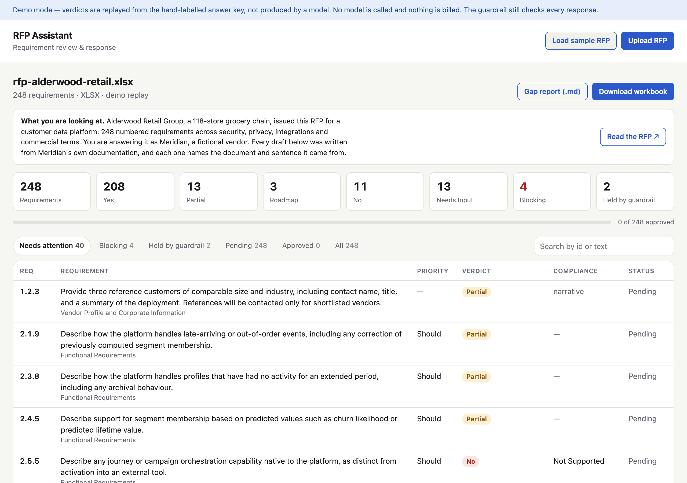
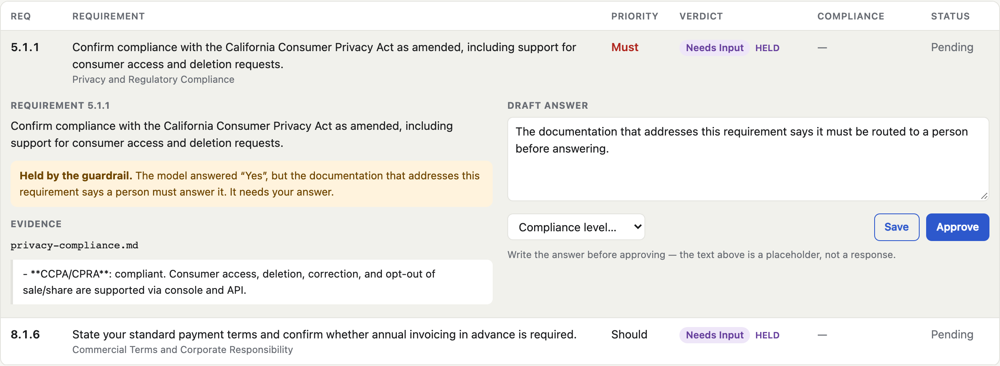
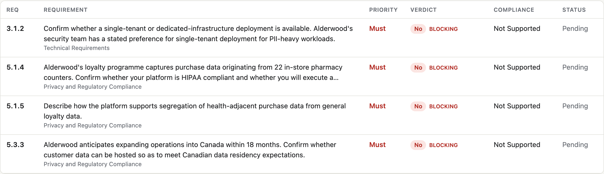

# RFP Response Assistant

Enterprise RFPs arrive as hundreds of numbered requirements in a spreadsheet or
a PDF. Answering one takes a solutions engineer days, and the answers become
contractual commitments.

This reads the RFP, extracts every requirement, finds the product documentation
that answers each one, drafts a cited response, and refuses to answer anything
it cannot cite.

**[▶ Live demo](https://rfp-assistant-codebyconnors-projects.vercel.app)** ·
248 requirements, fully clickable, no signup.



## What it does

```
RFP (.xlsx / .pdf / .md)
   → parse        248 requirements, skipping boilerplate
   → retrieve     the documentation that answers each one
   → classify     Yes · Partial · No · Roadmap · Needs Input
   → verify       every answer must quote its source, verbatim
   → review       a human approves each one
   → export       answers written back into the buyer's own workbook
```

The export matters most: it fills in the buyer's actual spreadsheet, preserving
their scoring formulas and dropdowns, because that file is the deliverable.
Only approved rows are written — unreviewed drafts never reach the customer.

## The rule the whole thing is built on

**It never answers what it cannot cite.** The model must name one document and
quote it word for word. That quote is then checked against the document; if it
isn't there, the answer is thrown away. And if the evidence it relied on says a
human must handle the question, the answer is held no matter how confident it
was.



Here the model answered "Yes" and the system overruled it, because the
documentation it cited says to route the question to a person. An RFP answer
becomes a contract — a confident wrong "Yes" on HIPAA is far more expensive
than an honest "we need to check."

## What it surfaces

Not every gap matters equally. A hard "No" against a requirement the buyer
marked mandatory is what decides whether the deal is winnable, so those sort to
the top of the gap report instead of being buried among 247 others.



## How it's measured

Everything below runs offline, for free, with no API key.

| | |
|---|---|
| **Parsing** | 248/248 requirements, identical across .xlsx, .pdf and .md, exact text match |
| **Retrieval** | 98.3% recall against hand-labelled citations |
| **Guardrail** | a fabricated quote is caught every time; unanswerable requirements held 11/11 |
| **Access control** | zero internal-only documents leak, checked across all 248 requirements |
| **Tests** | 146, all offline |

The headline classification metric is deliberately **not** accuracy. The errors
are not symmetric: answering "Partial" where the truth is "Yes" costs a
reviewer a correction, while answering "Yes" where the truth is "No" puts a
capability the product lacks into a contract. So overstatements are counted
separately, and that is the number driven to zero.

## Two things I got wrong, and the measurements that caught them

**A similarity threshold cannot detect an unanswerable question.** The original
design held an answer when retrieval scored too low. Measured, the score
distributions overlapped almost entirely — the sustainability question scored
*higher* than 75% of answerable ones, because the documentation discusses
sustainability at length in order to say there is no company position on it.
Relevance and answerability are different properties. The guardrail now runs
after the model commits to its evidence, not before.

**Embeddings weren't needed.** BM25 reaches 98.3% recall here, because
requirements and documentation share vocabulary almost verbatim — "SAML",
"HIPAA", "Kafka", "RPO". An embedding model would have added hundreds of
megabytes for at most 1.7 points, within noise on a 120-item key.

## Running it

```bash
python3 -m venv .venv && source .venv/bin/activate
pip install -r requirements-local.txt

python -m rfp_assistant serve              # the full tool
python -m rfp_assistant eval-retrieval     # score retrieval, free
pytest
```

Classifying with a real model is opt-in twice: `--live`, plus a confirmation
showing the estimated cost. A full 248-requirement run is about **$0.52** on
Haiku 4.5, **$1.05** on Sonnet 5, or **$2.60** on Opus 5.

```bash
python -m rfp_assistant eval-classify --live --limit 30 --model claude-haiku-4-5
```

## The demo is not the tool

| | live demo | run locally |
|---|---|---|
| verdicts | replayed from the answer key | a real model |
| uploads | parsed only | parsed and classified |
| state | kept in your browser | kept on disk |
| can reach a model | never | with `--live` |

The deployed demo cannot call a model at all — no client is constructed and the
classification code is never reached. A public URL that can spend an API budget
is a public URL someone else can spend. Uploading your own RFP there runs the
parser on your real file, which needs no model and costs nothing.

## Known limits

- **It over-escalates.** The CCPA requirement pictured above is a false
  positive: the paragraph it cited also contains a routing instruction about a
  neighbouring topic, and the check reads the whole cited chunk. Finer-grained
  chunking would fix it. The eval tracks it rather than hiding it.
- **The PDF parser keys on `N.N.N` numbering.** An RFP numbered `REQ-4.2.3`
  would extract nothing, so the parser reports coverage to make that failure
  loud rather than silent.
- **All data here is fictional.** The vendor (Meridian), the buyer (Alderwood
  Retail Group), the documentation and the RFP were written for this project.
  No real company, pricing or security posture is represented.

## Built with

Python · FastAPI · BM25 retrieval · Claude API · openpyxl · pdfplumber ·
deployed on Vercel
